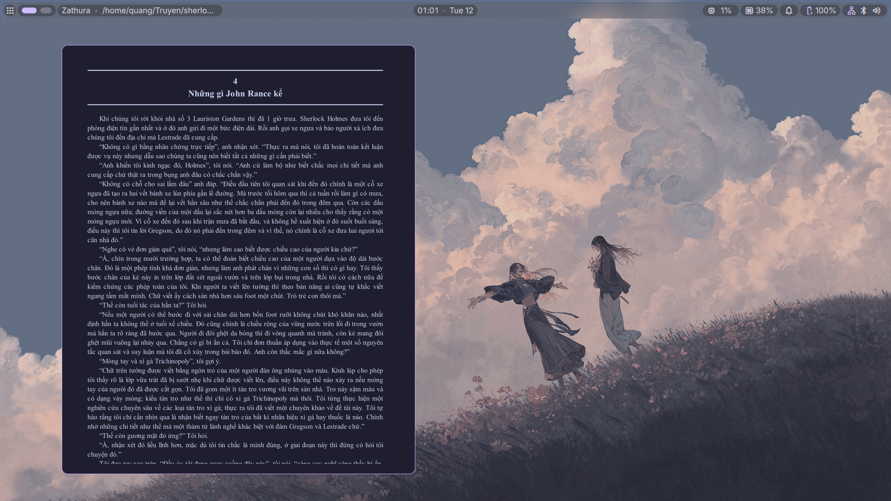
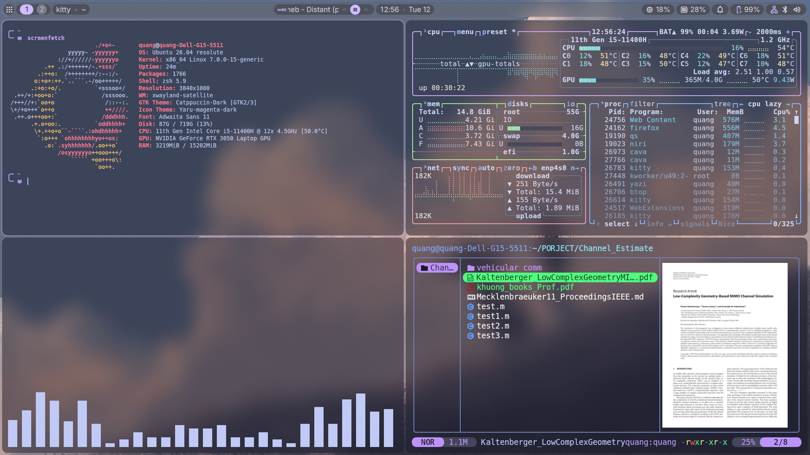

<h1 align="center"> My Ubuntu dotfiles</h1>

## SHOWCASE
 
 

## KEYBOARD SHORTCUTS
* View in `.config/niri/config.kdl`
* View in `.config/kitty/kitty.conf`
* View in `.config/nvim/README.md`

## ALIAS
* View in `.zshrc`

