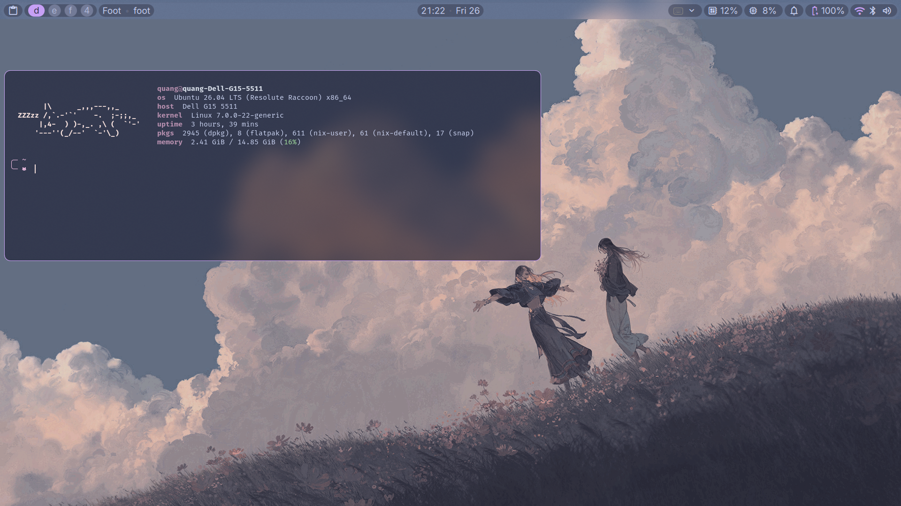

# UbuntuConfig


Personal Ubuntu dotfiles managed with Nix flakes and Home Manager.

## Showcase 
 
## Quick Install

Paste this into a terminal on Ubuntu:

```bash
bash <(curl -fsSL https://raw.githubusercontent.com/ledangquangdangquang/UbuntuConfig/main/install.sh)
```

The script installs Nix if needed, enables flakes, clones this repo to `~/UbuntuConfig`, applies the Home Manager profile for the current Linux user, and sets zsh as the default shell.

## Overview

This repository is built for a non-NixOS Ubuntu setup. Nix and Home Manager install user packages, manage shell/browser/GTK settings, and symlink application configs from this repo into `~/.config`.

Main stack:

| Area | Tools |
| --- | --- |
| Shell | Zsh, Oh My Zsh, Starship |
| Window manager | Niri on Wayland |
| Terminal | Foot, Kitty |
| Editor | Neovim |
| Launcher/UI | Vicinae, DankMaterialShell |
| File manager | Yazi |
| Browser | Firefox |
| Theme | Catppuccin, Bibata cursor, Nerd Fonts |

## Repository Layout

```text
.
├── flake.nix          # Flake inputs and Home Manager entry
├── home.nix           # Packages, config symlinks, shared Home Manager setup
├── modules/           # Focused Home Manager modules
├── dotfiles/          # App configs linked into ~/.config
├── Wallpapers/        # Wallpaper and avatar assets
├── AGENTS.md          # Contributor/agent guide
└── flake.lock         # Locked dependency versions
```

Important modules:

- `modules/zsh.nix`: Zsh setup, aliases, shell functions.
- `modules/git.nix`: Git identity, Git alias, SSH config for GitHub.
- `modules/gtk.nix`: GTK theme, fonts, cursor theme.
- `modules/firefox/default.nix`: Firefox package, policies, profile config.

## Setup

Enable Nix flakes if needed:

```bash
mkdir -p ~/.config/nix
echo "experimental-features = nix-command flakes" >> ~/.config/nix/nix.conf
```

Clone this repo to the expected path:

```bash
git clone git@github.com:ledangquangdangquang/UbuntuConfig.git ~/UbuntuConfig
cd ~/UbuntuConfig
```

Apply the Home Manager configuration for the current Linux user:

```bash
USER="$(id -un)" nix run github:nix-community/home-manager -- switch --impure --flake ".#$(id -un)"
```

After Home Manager is installed, you can use:

```bash
USER="$(id -un)" home-manager switch --impure --flake ".#$(id -un)"
```

## Common Commands

```bash
nix flake check --no-build
```

Validate flake outputs without building everything.

```bash
nix build .#homeConfigurations.quang.activationPackage
```

Build the Home Manager activation package and catch evaluation/build warnings.

```bash
nix fmt
```

Format Nix files with the formatter declared in `flake.nix`.

## Maintenance

Nix keeps old builds in `/nix/store`, so clean garbage when `/` is low on space or rebuild fails with a disk-space error:

```bash
nix store gc
```

Check disk usage before rebuilding:

```bash
df -h / /home
```

## Customization

To add a new app config:

1. Put the config directory under `dotfiles/<app>/`.
2. Add `<app>` to `configApps` in `home.nix`.
3. Run `home-manager switch --flake .#quang`.

User-specific values live in `flake.nix` and `home.nix`, including `user`, `hostname`, `homeDirectory`, and `stateVersion`.

## Notes

- Keyboard shortcuts are mainly in `dotfiles/niri/config.kdl`, `dotfiles/kitty/kitty.conf`, and the Neovim config.
- Shell aliases are managed in `modules/zsh.nix`.
- Do not commit secrets, SSH private keys, browser sessions, or generated logs.
