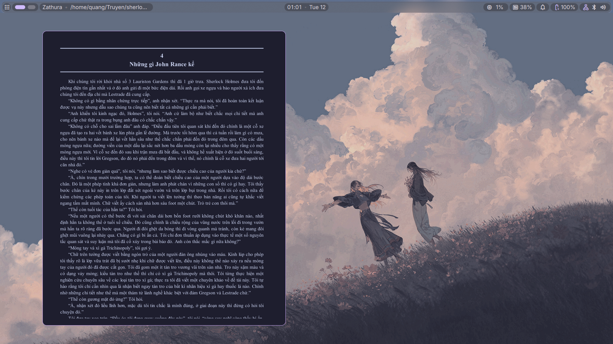
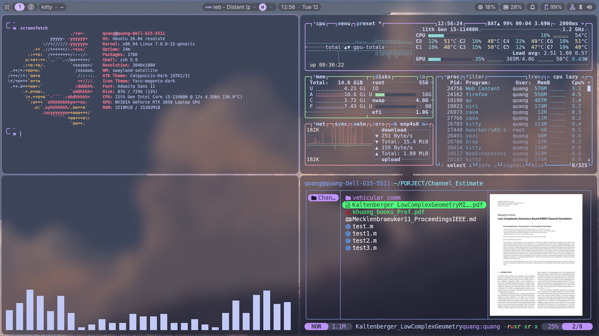

<h1 align="center"> My Ubuntu dotfiles</h1>

<div align="center">


</div>

## SHOWCASE
 
 

## SETUP
```
echo "experimental-features = nix-command flakes" >> ~/.config/nix/nix.conf
```
```
nix run github:nix-community/home-manager -- switch --flake .#quang
```
## KEYBOARD SHORTCUTS
* View in `.config/niri/config.kdl`
* View in `.config/kitty/kitty.conf`
* View in `.config/nvim/README.md`

## ALIAS
* View in `.zshrc`

## Components

| Component             | Version/Name                |
|-----------------------|-----------------------------|
| Distro                | Ubuntu|
| Shell                 | Zsh|
| Display Server        | Wayland                     |
| WM (Compositor)       | Niri|
| UI                    | Dank Linux|
| Launcher              | Vicinae
| Editor                | Neovim|
| Terminal              | Foot + Starship          |
| Fetch Utility         | Fastfetch                   |
| Theme                 | Catppuccin Mocha 
| Icons                 | Colloid-teal-dark, Numix-Circle |
| Font                  | JetBrains Mono |
| Player                | Kew + Spotify      |
| File Browser          | Thunar + Yazi               |
| Internet Browser      | Firefox + Vimium + NightTab + Stylus |
| Mimetypes             | MPV, Imv, Zathura            |
