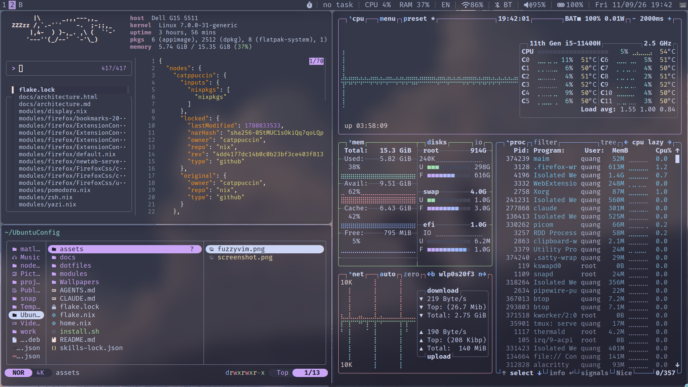

https://github.com/user-attachments/assets/48d9f3bc-88d9-4c06-a4c0-6a3dcaafcf01


<h1 align="center">UbuntuConfig</h1>
<p align="center">
  <a href="https://nixos.org"></a>
  <a href="https://github.com/nix-community/home-manager"></a>
  <a href="https://i3wm.org"></a>
  <a href="https://github.com/catppuccin/catppuccin"></a>
</p>

> A keyboard-driven i3 rice for plain Ubuntu (no NixOS), themed Catppuccin Mocha end to end. One Nix flake + Home Manager command rebuilds the whole desktop (Rofi menus, Kitty, Neovim, Yazi, Firefox, Vietnamese input), and dotfiles are symlinked so edits apply instantly.


https://github.com/user-attachments/assets/27531307-e97f-446b-9237-6f42d2cc7d1f




## What's installed

| Category | Tools |
| --- | --- |
| Window Manager | i3 (installed externally) + i3status-rust |
| Shell | Zsh + Starship |
| Terminal | Kitty, Alacritty |
| Launcher | Rofi (`Mod+space`: run / drun / ssh) |
| Quick menus | Rofi-driven power, Wi-Fi, Bluetooth, clipboard, display, and pomodoro-task pickers |
| Notifications | dunst (custom sound + volume ducking on notify) |
| File Manager | Yazi (smart-enter, full-border, jump-to-char, git, mount plugins) |
| Browser | Firefox (Catppuccin CSS, managed extensions, custom new-tab page) |
| Editor | Neovim + fuzzyvim (`Ctrl+F` fzf file picker with preview) |
| Screenshot | maim + Satty |
| Clipboard History | cliphist |
| Input Method | Fcitx5 + Unikey |
| Multiplexer | Tmux (Catppuccin, resurrect, continuum) |
| System Monitor | Btop |
| Media | VLC, kew |
| Theme | Catppuccin Mocha, applied everywhere |
| Housekeeping | Weekly `nix store gc` via systemd timer |

## Structure

```
.
├── flake.nix       # flake inputs, hostname, user, stateVersion
├── home.nix        # minimal Home Manager entry point
├── modules/        # focused Home Manager modules
│   └── default.nix # imports all modules
├── dotfiles/       # app configs symlinked into ~/.config
├── Wallpapers/     # wallpaper assets
├── docs/           # architecture notes
├── install.sh      # one-shot bootstrap script
├── flake.lock      # locked dependency versions
└── README.md       # this file
```

## How to use

1. **Add a package** → edit `modules/packages.nix`
2. **Add an app config** → create `dotfiles/<app>/`, then add `"<app>"` to `configApps` in `modules/dotfiles.nix`
3. **Add Home Manager logic** → create a new file under `modules/`, import it from `modules/default.nix`
4. **Apply** → `home-manager switch --flake ".#$USER"`

Config files in `dotfiles/` are symlinked directly — edit and see changes immediately, no rebuild needed.

## Common commands

```bash
home-manager switch --flake ".#$(whoami)"     # apply config
nix flake check                               # validate before switching
nix fmt                                        # format Nix files
nix store gc                                   # clean /nix/store
```

## Install

```bash
bash <(curl -fsSL https://raw.githubusercontent.com/ledangquangdangquang/UbuntuConfig/main/install.sh)
```

The installer sets up Nix, installs i3, clones the repo to `~/UbuntuConfig`, applies Home Manager, and sets Zsh as the default shell.

## Notes

- i3 shortcuts: `Mod+i` (see `dotfiles/i3/keyshortcuts.txt`)
- Shell aliases: `modules/zsh.nix`
- Do not commit secrets, SSH keys, browser sessions, or generated logs
- Audio: PipeWire (PulseAudio-compatible, controlled via `pactl`/`wpctl`)
- Brightness: `brightnessctl` / `ddcutil`
